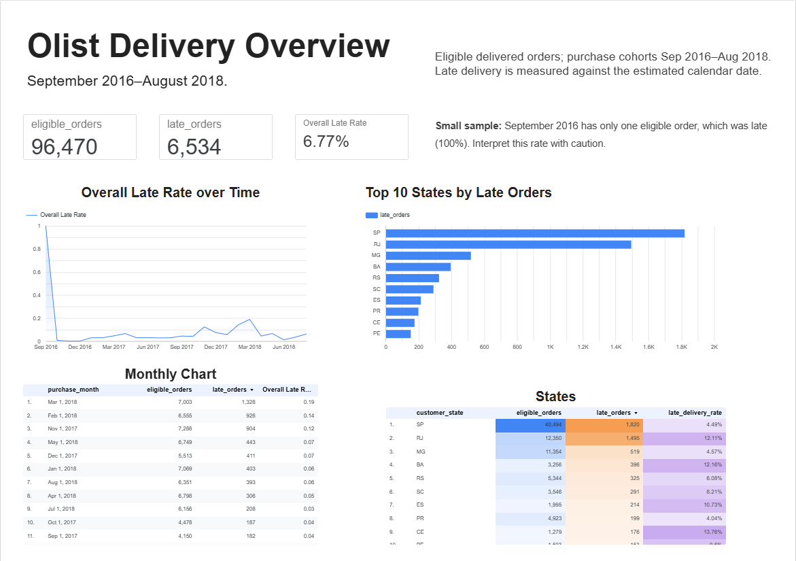
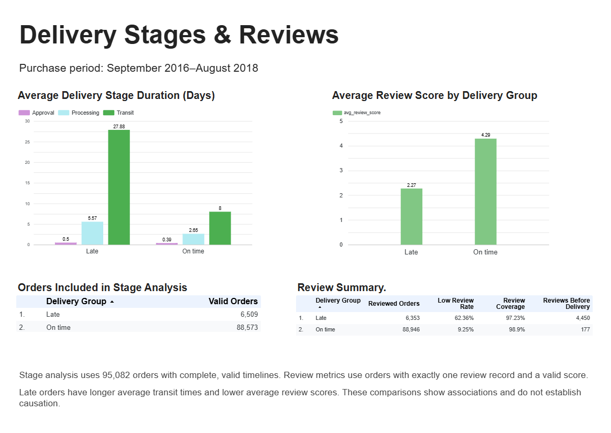
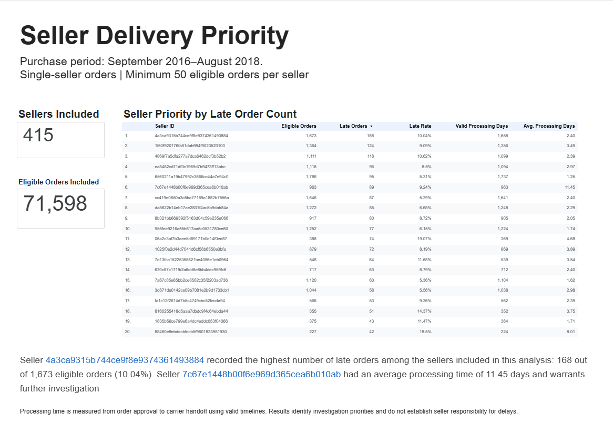

# Olist Delivery Performance Analysis

A SQL learning project exploring delivery timeliness, processing stages, customer reviews, and seller priorities using the Olist Brazilian e-commerce dataset.

**Tools:** Google BigQuery (Sandbox), Google Sheets, and Looker Studio.

## Business Questions

1. How does the late delivery rate change by purchase month?
2. Which destination states should be prioritized for delivery improvement?
3. How do delivery stage durations differ between late and on-time orders?
4. How do review scores differ between late and on-time orders?
5. Which sellers should be prioritized for further investigation?

## Key Findings

The analysis includes **96,470 eligible delivered orders**, of which **6,534 were late (6.77%)**. Eligible purchase months range from September 2016 to August 2018.

- **Monthly trend:** March 2018 had the most late orders: 1,328 out of 7,003 eligible orders (18.96%). September 2016 had a 100% late rate but only one eligible order.
- **Destination states:** SP had 1,820 late orders and RJ had 1,495. Together, they accounted for 50.73% of late orders. RJ's late rate was 12.11%, compared with 4.49% in SP.
- **Delivery stages:** Average transit time was 27.88 days for late orders versus 8.00 days for on-time orders, using complete, valid timelines.
- **Customer reviews:** Average scores were 2.27 for late orders and 4.29 for on-time orders. The share of scores 1–2 was 62.36% versus 9.25%, respectively.
- **Seller priorities:** Among 415 sellers meeting the analysis criteria, seller `4a3ca9315b744ce9f8e9374361493884` had the most late orders (168). Seller `7c67e1448b00f6e969d365cea6b010ab` had an average processing time of 11.45 days and warrants further investigation.

## Suggested Follow-up

Prioritize investigation in SP and RJ, examine transit delays, and review processing patterns for the identified sellers. These findings identify areas to investigate; they do not establish the causes of delays or low review scores.

## Dashboard

### Delivery Overview

### Delivery Stages & Reviews

### Seller Priority

## Method

- Late delivery means the actual delivery **date** is after the estimated delivery **date**.
- Monthly results are grouped by purchase month.
- Stage analysis uses 95,082 orders with complete, chronological timelines.
- Review metrics use orders with exactly one raw review record and a valid score from 1 to 5.
- Seller analysis uses single-seller orders and a minimum of 50 eligible orders per seller, covering 71,598 orders.
- Dashboard data comes from SQL results exported to Google Sheets; it is a snapshot, not a live BigQuery connection.

See [methodology](docs/methodology.md), [SQL queries](sql/), and [data setup](data/README.md).

## Data Source

[Brazilian E-Commerce Public Dataset by Olist on Kaggle](https://www.kaggle.com/datasets/olistbr/brazilian-ecommerce).

Raw data is obtained from the original source and is not included in this repository.
